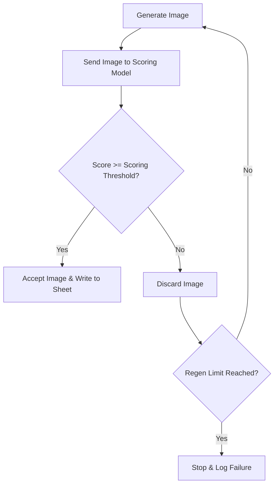

<!--
Copyright 2024 Google LLC

Licensed under the Apache License, Version 2.0 (the "License");
you may not use this file except in compliance with the License.
You may obtain a copy of the License at

      http://www.apache.org/licenses/LICENSE-2.0

Unless required by applicable law or agreed to in writing, software
distributed under the License is distributed on an "AS IS" BASIS,
WITHOUT WARRANTIES OR CONDITIONS OF ANY KIND, either express or implied.
See the License for the specific language governing permissions and
limitations under the License.
-->

# 🍌 BackgroundR 2.0

[](https://github.com/google-marketing-solutions/backgroundr/commits)

[](https://github.com/google/gts)
[](https://github.com/google-marketing-solutions/backgroundr/blob/main/LICENSE)
[](https://github.com/google-marketing-solutions/backgroundr/graphs/contributors)

## 📖 Overview

**BackgroundR 2.0** leverages Google's **Nano Banana** model for comprehensive AI image editing. Far beyond simple background replacement, it instantly performs any visual edit needed to align your image assets with your corporate brand guidelines.

Built as an elegant, web-native Google Sheets Add-on, BackgroundR lets you process images in bulk directly from Google Sheets, powered by Gemini Enterprise Agent Platform (formerly Vertex AI).

---

## ✨ Key Features

- 🍌 **State-of-the-art AI Models**: Native integration with **Nano Banana**.
- ⚙️ **Configurable Prompts**: Prepend and append custom prompt prefixes/suffixes automatically to match your brand style.
- 📂 **Bulk Google Drive Syncing**: Load and save images to and from designated Drive folders seamlessly.
- 📐 **Advanced Multi-variant Generation**: Custom sheets to define ingredient images and text variants to overlay or outpaint.
- 🎯 **Automated Quality Control**: Scoring mechanism powered by Gemini to ensure every generated asset meets your quality threshold.

---

## 🛠️ Architecture & Tech Stack

BackgroundR uses a modern, lightweight stack to deliver advanced GenAI features inside Google Workspace:

- **Frontend (Sidebar UI)**: Built with **Angular 19** as a single-page application, optimized for seamless interactions.
- **Backend Engine**: Powered by **TypeScript** transpiled to **Google Apps Script**, managed with [Clasp](https://github.com/google/clasp).
- **Generative AI APIs**: Integrated directly with GCP's **Gemini Enterprise Agent Platform (formerly Vertex AI)** (Nano Banana).

---

## 🚀 Getting Started

We aim to keep BackgroundR simple yet scalable. Follow these steps to set up and start generating assets:

### 1. Clone the Google Sheet Template
Make a copy of this [Google Sheet Template](https://docs.google.com/spreadsheets/d/1FPlQbvqovVNlUFsCLJ9c_aEZ9bMDiZxVi4VsDn7daWM/copy).

### 2. Set Up Your Drive Directories
1. Create a folder in Google Drive to store your raw "base" product images.
2. Copy your folder's ID from its URL.
   > **Example**: For URL `https://drive.google.com/drive/folders/1jt88MGoqMTGhuGYujiOpY8wUD_3aZsJF`, the folder ID is `1jt88MGoqMTGhuGYujiOpY8wUD_3aZsJF`.

### 3. Open the Configurator
In the Google Sheet menu bar, go to **BackgroundR on 🍌s** > **🎨 Open configurator**.
> [!NOTE]
> You might need to authorize the script to run in your account on the first launch.

### 4. Configure your GCP Project & Drive Folder
Under the **Config** sheet or inside the configurator sidebar, set:
- **Cloud Project ID**: Your GCP Project where the Gemini Enterprise Agent Platform (formerly Vertex AI) API is enabled.
- **GCP Location**: Region of your choice (e.g. `us-central1` or `europe-west3`).
- **Drive Folder ID**: Paste the Google Drive folder ID copied in Step 2.

> [!IMPORTANT]
> Ensure the [Gemini Enterprise Agent Platform (formerly Vertex AI) API](https://cloud.google.com/vertex-ai/docs/generative-ai/start/quickstarts/api-quickstart) is enabled on your GCP Project.

### 5. Run and Generate
1. Select **BackgroundR on 🍌s** > **📥 Load images from Google Drive** to populate Column A with your source images.
2. Set your variants in the `Dropdowns` and `Ingredients` sheets.
3. Click **Apply Selections** or **Universal Generate** in the sidebar and watch the AI generate your brand-aligned images!

> [!NOTE]
> BackgroundR only creates new images for empty cells. To replace existing images, clear columns **E**, **F**, and **G** first.
>
> Nano Banana enforces an image size limit of ~30MB; larger files will be skipped.

---

## ⚙️ Configuration Options

The `Config` sheet governs BackgroundR behavior. Here is a description of the configurations:

| Configuration Option | Description | Example / Default Value |
| :--- | :--- | :--- |
| **Cloud Project Id** | Google Cloud Project ID with Gemini Enterprise Agent Platform (formerly Vertex AI) enabled | `my-brand-gcp-project` |
| **Image Generation Model** | Model ID used for image generation | `gemini-2.5-flash-image` |
| **Scoring Model** | Model ID used for scoring generated images | `gemini-2.5-flash` |
| **Drive Folder Id** | Google Drive Folder ID containing your source images | `1jt88MGoqMTGhuGYujiOpY8wUD_3aZsJF` |
| **GCP Location** | Cloud region for Gemini Enterprise Agent Platform (formerly Vertex AI) API calls | `us-central1` or `europe-west3` |
| **Dropdowns sheet** | The sheet defining your variant prompt definitions | `Dropdowns` |
| **Ingredients sheet** | The sheet defining ingredient image assets | `Ingredients` |
| **Prompt Prefix** | Text automatically prepended to all generated prompts | `A professional studio photo of...` |
| **Prompt Suffix** | Text automatically appended to all generated prompts | `..., high quality, brand aligned.` |
| **Image Scoring Prompt** | System instructions used to evaluate the quality of images | `Verify if the image looks realistic...` |
| **Scoring results sheet** | Sheet where image scoring results are saved | `Scoring results` |

---

## 🎯 Scoring & Automated Regeneration

To maintain production-grade standards, BackgroundR features an automated quality control loop:



1. **Evaluation**: Each generated image is evaluated by the **Scoring Model** utilizing the **Image Scoring Prompt**.
2. **Scoring**: The model writes a numerical **Score** and feedback explanation to the **Scoring results sheet**.
3. **Threshold Check**:
   - If the score is **greater than or equal to** the threshold, the image is accepted.
   - If the score is **below** the threshold, it is discarded and automatically queued for regeneration.
4. **Loop Control**: Regeneration repeats until a qualified asset is generated or the **Max regeneration** limit is hit.

---

## 🧑‍💻 Developer Guide

If you are looking to modify or deploy BackgroundR yourself, follow these developer guidelines.

### Setup Requirements
- **Node.js** (>= 16.x)
- **Google Clasp** (already included in local project dependencies, or optionally installed globally: `npm install -g @google/clasp`)

### Installation
Install the parent and UI module dependencies:
```bash
npm install
```
*(This will trigger a post-install script to set up the Angular workspace inside `src/ui` automatically).*

### Local UI Development
To develop the Sidebar interface locally:
```bash
npm run serve-ui
```
This spins up the Angular development server at `http://localhost:4200`.

### Deployment
To build the TypeScript codebase, compile and inject the Angular app into Google Apps Script format, and push via [Clasp](https://github.com/google/clasp):

1. **Login to clasp**:
   ```bash
   clasp login
   ```
2. **Initialize clasp files**:
   Set up your `.clasp-dev.json` or `.clasp-prod.json` with your Google Apps Script project ID.
3. **Deploy**:
   ```bash
   # Deploy to Dev environment
   npm run deploy

   # Deploy to Production target
   npm run deploy:prod
   ```

---

## 📜 License & Disclaimer

Licensed under the Apache-2.0 License. See the [LICENSE](LICENSE) file for details.

**This is not an officially supported Google product.**

